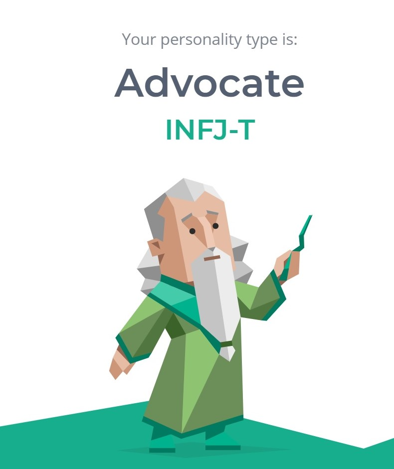
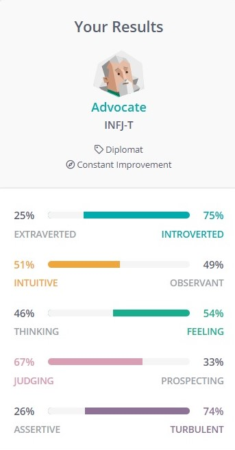

## My Personality According to 16personalities.com

 -An Advocate (INFJ) is someone with the Introverted, Intuitive, Feeling, and Judging personality traits. They tend to approach life with deep thoughtfulness and imagination. Their inner vision, personal values, and a quiet, principled version of humanism guide them in all things.

 -Advocates are the rarest personality types of all. Still, Advocates leave their mark on the world. They have a deep sense of idealism and integrity, but they aren’t idle dreamers – they take concrete steps to realize their goals and make a lasting impact.

 -Advocates’ unique combination of personality traits makes them complex and quite versatile. For example, Advocates can speak with great passion and conviction, especially when standing up for their ideals. At other times, however, they may choose to be soft-spoken and understated, preferring to keep the peace rather than challenge others.

   

**Result**: Advocate(INFJ) 

## Conclusion

 -Few personality types are as passionate and enigmatic as Advocates (INFJs). 
 As someone with this personality type, you stand out for 
 your imagination, your compassion, your integrity, and your deeply held principles.                       
 Unlike many other idealistic types, however, 
 you are also capable of turning your ideals into plans and executing them.
                                                                                        

 -Yet Advocates face challenges too. 
 Even the most idealistic and dedicated of personality types can become frustrated 
 when it comes to navigating interpersonal conflicts, confronting unpleasant facts, 
 pursuing self-realization, or finding a fulfilling career path. 
 As a result, you may sometimes find yourself questioning 
 who you really are – and who you’re really meant to be.

## A Personal Misson

 -Many Advocates feel compelled to find a mission for their lives. 
 When they encounter inequity or unfairness, they tend to think, “How can I fix this?” They are well-suited to support a movement to right a wrong, no matter how big or small. 
 Advocates just need to remember that while they’re busy taking care of the world, they need to take care of themselves too.

**Advocates**: Nelson Mandela , Mother Teresa , Morgan Freeman ,
Elton John , George Clooney , Angelina Julie  

---

[What's your personality?!(English)](http://www.16personalities.com)

[What's your personality?!(Persian)](http://www.16personalities.com/fa)
