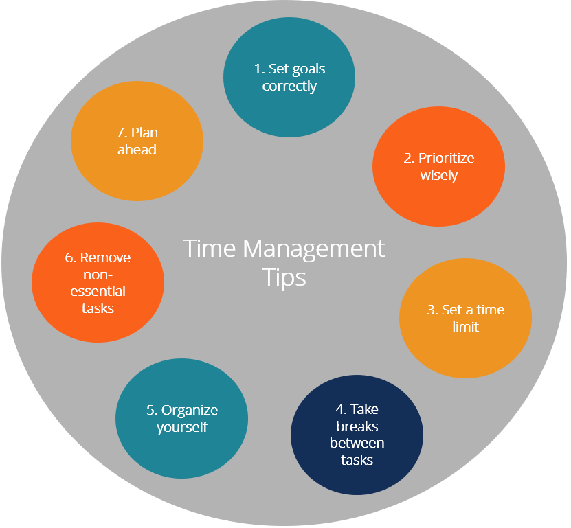

{: style="text-align: center" }
## مصاحبه با خانم فصاحت و آقای غلام پور 

---

 ***برنامه ریزی شما به چه شکل است؟ (روزانه ، هفتگی ، ماهانه یا سالانه )***

> خانم فصاحت: من سعی می کنم یک دید کلی نسبت به ترم داشته باشم بعد بر اساس ترم به صورت روزاته برنامه بریزم و هر شب کار های فردا رو در در گوگل کلندر برنامه بریزم  

> آقای غلام پور:  به صورت روزانه برنامه میریزم  

---

 ***چجوری به برنامه خودتون میرسین و آیا برنامه ریزی شما بر اساس زمان است یا اهدافی که تعیین می کنین بدون در نظر گرفتن زمان انجام آن؟***

> خانم فصاحت: برنامه ریزی باعث میشه از هرج و مرج جلوگیری شه و این که برنامه بر اساس زمان اگه باشه باعث میشه سرعت انجام یک کار هم بیشترشه 

> آقای غلام پور:  واقع بینانه باید برنامه ریزی کرد. مثلا من تایمای ۱و نیم ساعته میزارم. بینشون ۳۰ دقیقه وقت میزارم که اگر نرسیدم بتونم تو اون تایم برسونم

---

 ***وقتایی که از لحاظ روحی افت می کنین چه کاری میکنید و به برنامتون چقدر آسیب میزنه؟***

> خانم فصاحت: در قرنطینه این افت بیشتر احساس  میشه ولی من سعی می کنم این مشکل رو با ورزش به طور روتین رفع کنم و مشکلات رو خیلی زود با خودم حل کنم وگنه ادامه دادن ناراحتی باعث آسیب زدن به خود فرد میشه و هیچ فایده ای نداره

> آقای غلام پور:سریال میبینم. به فکر آسیبش نیستم. وقتی داری استراحت میکنی داری بازده تو میبری بالا

---

 ***اوایل دانشگاه چی کار باید کرد و چی کار  نباید کرد که تو زمان کمتر نتیجه بهتری بگیرین ؟***

> خانم فصاحت: سعی کنین با افراد مختلف در دانشگاه ارتباط داشته باشین

> آقای غلام پور:اگر استاد یه مبحثی رو درس نمیده به این معنی نیست که تو نباید یادش بگیری. خیلی از وقتا اساتید به طور عمیق درس نمیدن ولی انتظار دارن بلد باشی. اگر سعی کنی درسارو با اساتید ببری جلو و بخونی و نزاری همشو برای آخر ترم بهتره

---

 ***کاری رو قراره انجام بدین ولی هر روز اون کاری رو که مستمر انجام دادین و الویت کمتری داره به نسبت اون کاری که جمع شده ، انجام میدین و باز اون کار اصلی میوفته به روز های بعد چجوری این وضعیت رو مدیریت میکنین و به چه نحوی این مرحله از کار رو پشت سر میزارین  ؟***

>خانم فصاحت:این مشکل خیلی شایع هست و من برای مدیریت این موضوع کاری که کردم این بود که کارارو به شکل خرد خرد و کم کم انجام میدم و اون رو برای خودم مثل دارویی تصور میکنم که هر 8 ساعت باید مصرف شه

> ***آقای غلام پور:.اگر واقعا کارها زیاد باشه و اهمیت بدی بهشون خود به خود از کارای بی اهمیت مستمرت دست میکشی. اینکه جای کارای مستمرت کارایی رو که دوست داری و مفید هستندو جایگزین کنی هم مفیده. مثلا جای کار با موبایل بشینی زبان برنامه نویسی که دوست داری رو یاد بگیری. که حداقل وقتت مفید استفاده بشه

---

 ***زمانی از هفتتون رو برای تفریح کنار میزارین تو دوران دانشگاه و اهداف جنبی دیگه ای هم هست که بخواین به اونام برسین ؟***

> خانم فصاحت: من به شخصه درس خوندن همیشگی کاراییم رو میاره پایین . حالا هر کسی به نحوی کاری رو که فکر می کنه حالشو خوب میکنه انجام میده . ولی باز به خود فرد بستگی داره . درواقع تفریح کردن هم یک تلاش غیر به حساب میاد چون کسی که میخواد درس بخونه و کاریی خوبی داشته باشه نیاز به استراحت داره ولی حد اون تفریح هم باید رعایت شه که کار ها رو به هم نریزه

> آقای غلام پور:ین سوال خوبیه به نظر من. ببین توی دانشگاه وقت اضافی زیاد داری. مخصوصا ترمای اول. ببین توی دانشگاه اصلا نباید تک بعدی باشی. باید هم به تفریحاتت برسی هم به درس. اشتباهه که فقط یکیو داشته باشی. حالا هر چی میخواد باشه. اینکه چقدر دقیقا درسا وقتتو میگیرن به این بستگی داره که چند واحد میگیری. اگه واحدات معمولی باشه طبیعتا وقت اضافه میاری. موفقیت تو دانشگاه به سختی کنکور نیست. شرطش اینه که ترم ۱ و ۲ رو خوب معدل بیاری. اگر از ترمای اول خوب بخونی خیلی کارت آسون میشه

---
