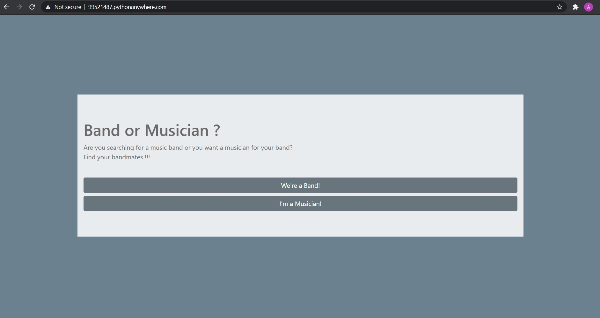

## Let's Play Some Tunes (LPST)
در این پروژه هدف من ساختن یک پل ارتباطی بین نوازنده ها و گروه های موسیقی بود 
که این کار با اینکه ممکنه از نظر هنری خیلی موفقیت آمیز نباشه اما این موضوع صرفا علاقه ی خودم بود
یکی از اصلی ترین رکن های این برنامه دیتابیس آن است
که براساس آن نوازنده بند مورد نظر خود را پیدا می کند یا برعکس 
شما میتوانید با انتخاب ساز و سبک مورد نظر نوازنده مورد نیاز یا بند مورد نظر خود را پیدا کنید
برای فهم بیشتر از طریق لینک زیر یا عکس به سایت برین و
سبک راک و ساز گیتار الکتریک را انتخاب کنید اون وفت از طریق ایمیل میتوانید با بند یا نوازنده مورد نظر ارتباط داشته باشین
genre:rock
instrument:guitar electric
   

---
[Lets Play Some Tunes](http://99521487.pythonanywhere.com)